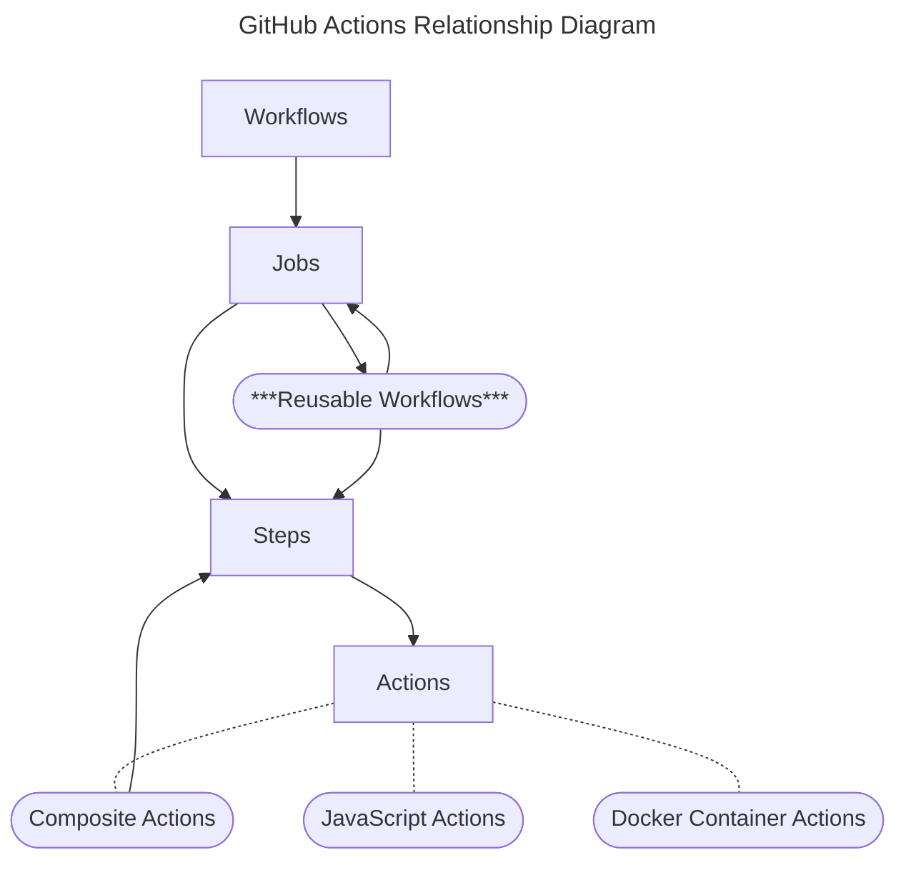

# DevantlerTech GitHub Reusable Workflows 🚀

> [!NOTE]
> To see DevantlerTech's Actions, please visit the [devantler-tech/actions](https://github.com/devantler-tech/actions) repository.

Welcome to the DevantlerTech GitHub Reusable Workflows repository! This repository contains [reusable workflows](#reusable-workflows) designed to streamline your CI/CD processes. These actions are used across all DevantlerTech projects, ensuring consistency and efficiency.

The below diagram illustrates the relationship between GitHub Workflows and GitHub Actions.


```mermaid
---
title: GitHub Actions Relationship Diagram
---
flowchart TD
  A[Workflows] --> B[Jobs]
  B --> C([***Reusable Workflows***])
  B --> D[Steps]
  C --> D
  C --> B
  D --> E[Actions]
  E -.- F([Composite Actions])
  F --> D
  E -.- G([JavaScript Actions])
  E -.- H([Docker Container Actions])
```

## Reusable Workflows

[Reusable workflows](https://docs.github.com/en/actions/how-tos/sharing-automations/reuse-workflows#creating-a-reusable-workflow) are designed to encapsulate common CI/CD patterns that can be shared across multiple repositories. They allow you to define a workflow once and reuse it in the job-scope of other workflows. This reduces duplication and enables building generic workflows for common tasks.

### CD - .NET Library Publish

<details>
<summary>Click to expand</summary>

[.github/workflows/cd-dotnet-library-publish.yaml](.github/workflows/cd-dotnet-library-publish.yaml) is a workflow used to publish .NET libraries to NuGet and GHCR.

#### Usage

```yaml
jobs:
  publish-library:
    uses: devantler-tech/reusable-workflows/.github/workflows/cd-dotnet-library-publish.yaml@{ref} # ref
    secrets:
      NUGET_API_KEY: ${{ secrets.NUGET_API_KEY }}
```

#### Secrets and Inputs

| Key             | Type   | Default | Required | Description   |
|-----------------|--------|---------|----------|---------------|
| `NUGET_API_KEY` | Secret | -       | Yes      | NuGet API key |

</details>

### CD - Pages Publish

<details>
<summary>Click to expand</summary>

[.github/workflows/cd-pages-publish.yaml](.github/workflows/cd-pages-publish.yaml) is a workflow used to build and publish a Jekyll site to GitHub Pages.

#### Usage

```yaml
jobs:
  pages:
    uses: devantler-tech/reusable-workflows/.github/workflows/cd-pages-publish.yaml@{ref} # ref
    with:
      ruby-version: "3.3" # optional
      jekyll-env: production # optional
      extra-build-args: "" # optional, e.g. '--future'
      working-directory: "." # optional, e.g. 'docs' if Jekyll site is in a subdirectory
```

#### Secrets and Inputs

| Key                 | Type           | Default      | Required | Description                                                     |
|---------------------|----------------|--------------|----------|-----------------------------------------------------------------|
| `ruby-version`      | Input (string) | `3.3`        | No       | Ruby version to install                                         |
| `jekyll-env`        | Input (string) | `production` | No       | Jekyll environment                                              |
| `extra-build-args`  | Input (string) | `""`         | No       | Extra args appended before the automatically supplied --baseurl |
| `working-directory` | Input (string) | `"."`        | No       | Working directory for the Jekyll site (e.g., 'docs')            |

#### Outputs

| Key        | Description             |
|------------|-------------------------|
| `page_url` | Deployed Pages site URL |

</details>

### CI - Auto Merge

<details>
<summary>Click to expand</summary>

[.github/workflows/ci-auto-merge.yaml](.github/workflows/ci-auto-merge.yaml) is a workflow that automatically merges pull requests from trusted bots and maintainers.

#### Usage

```yaml
jobs:
  auto-merge:
    uses: devantler-tech/reusable-workflows/.github/workflows/ci-auto-merge.yaml@{ref} # ref
```

</details>

### CI - .NET Test

<details>
<summary>Click to expand</summary>

[.github/workflows/ci-dotnet-test.yaml](.github/workflows/ci-dotnet-test.yaml) is a workflow used to test .NET solutions or projects across multiple operating systems.

#### Usage

```yaml
jobs:
  dotnet-test:
    uses: devantler-tech/reusable-workflows/.github/workflows/ci-dotnet-test.yaml@{ref} # ref
    secrets:
      CODECOV_TOKEN: ${{ secrets.CODECOV_TOKEN }}
```

#### Secrets and Inputs

| Key             | Type   | Default | Required | Description   |
|-----------------|--------|---------|----------|---------------|
| `CODECOV_TOKEN` | Secret | -       | Yes      | Codecov token |

</details>

### CI - Docs

<details>
<summary>Click to expand</summary>

[.github/workflows/ci-docs.yaml](.github/workflows/ci-docs.yaml) is a workflow used to lint documentation files using the MegaLinter documentation flavor.

#### Usage

```yaml
jobs:
  docs-lint:
    uses: devantler-tech/reusable-workflows/.github/workflows/ci-docs.yaml@{ref} # ref
    secrets:
      APP_PRIVATE_KEY: ${{ secrets.APP_PRIVATE_KEY }}
```

#### Secrets and Inputs

| Key               | Type   | Default | Required | Description            |
|-------------------|--------|---------|----------|------------------------|
| `APP_PRIVATE_KEY` | Secret | -       | Yes      | GitHub App private key |

</details>

### CI - Go

<details>
<summary>Click to expand</summary>

[.github/workflows/ci-go.yaml](.github/workflows/ci-go.yaml) is a workflow used to lint and test Go projects across multiple operating systems.

#### Features

- **Automated Linting**: Runs `golangci-lint` and `mega-linter` to ensure code quality
- **Auto-fix**: Automatically applies linter fixes and commits them
- **Copilot Integration**: When linting fails, automatically prompts Copilot on the PR to fix the remaining issues

#### Usage

```yaml
jobs:
  go-test:
    uses: devantler-tech/reusable-workflows/.github/workflows/ci-go.yaml@{ref} # ref
    secrets:
      CODECOV_TOKEN: ${{ secrets.CODECOV_TOKEN }}
      APP_PRIVATE_KEY: ${{ secrets.APP_PRIVATE_KEY }}
    with:
      working-directory: "./" # optional
```

#### Secrets and Inputs

| Key                 | Type           | Default | Required | Description                                                          |
|---------------------|----------------|---------|----------|----------------------------------------------------------------------|
| `CODECOV_TOKEN`     | Secret         | -       | No       | Codecov token                                                        |
| `APP_PRIVATE_KEY`   | Secret         | -       | Yes      | GitHub App private key for authenticating the workflow               |
| `working-directory` | Input (string) | `./`    | No       | Working directory for Go commands (e.g., 'src' if go.mod is in src/) |

</details>

### Release

<details>
<summary>Click to expand</summary>

[.github/workflows/release.yaml](.github/workflows/release.yaml) is a workflow used to create releases using semantic-release.

#### Usage

```yaml
jobs:
  release:
    uses: devantler-tech/reusable-workflows/.github/workflows/release.yaml@{ref} # ref
    secrets:
      APP_PRIVATE_KEY: ${{ secrets.APP_PRIVATE_KEY }}
```

#### Secrets and Inputs

| Key               | Type   | Default | Required | Description            |
|-------------------|--------|---------|----------|------------------------|
| `APP_PRIVATE_KEY` | Secret | -       | Yes      | GitHub App private key |

</details>

### Sync Cluster Policies

<details>
<summary>Click to expand</summary>

[.github/workflows/sync-cluster-policies.yaml](.github/workflows/sync-cluster-policies.yaml) is a workflow used to sync upstream Kyverno policies to a target directory.

#### Usage

```yaml
jobs:
  sync-cluster-policies:
    uses: devantler-tech/reusable-workflows/.github/workflows/sync-cluster-policies.yaml@{ref} # ref
    secrets:
      APP_PRIVATE_KEY: ${{ secrets.APP_PRIVATE_KEY }}
    with:
      KYVERNO_POLICIES_DIR: policies/kyverno
```

#### Secrets and Inputs

| Key                    | Type           | Default | Required | Description                           |
|------------------------|----------------|---------|----------|---------------------------------------|
| `APP_PRIVATE_KEY`      | Secret         | -       | Yes      | GitHub App private key                |
| `KYVERNO_POLICIES_DIR` | Input (string) | -       | Yes      | Directory to sync Kyverno policies to |

</details>

### TODOs

<details>
<summary>Click to expand</summary>

[.github/workflows/todos.yaml](.github/workflows/todos.yaml) is a workflow used to scan for TODOs in code and create GitHub issues.

#### Usage

```yaml
jobs:
  todos:
    uses: devantler-tech/reusable-workflows/.github/workflows/todos.yaml@{ref} # ref
    secrets:
      APP_PRIVATE_KEY: ${{ secrets.APP_PRIVATE_KEY }}
```

#### Secrets and Inputs

| Key               | Type   | Default | Required | Description            |
|-------------------|--------|---------|----------|------------------------|
| `APP_PRIVATE_KEY` | Secret | -       | Yes      | GitHub App private key |

</details>

### Delete Workflow Runs

<details>
<summary>Click to expand</summary>

[.github/workflows/delete-workflow-runs.yaml](.github/workflows/delete-workflow-runs.yaml) is a workflow used to clean up old workflow runs from a repository.

#### Usage

```yaml
jobs:
  delete-runs:
    uses: devantler-tech/reusable-workflows/.github/workflows/delete-workflow-runs.yaml@{ref} # ref
    with:
      days: 30 # optional
      minimum_runs: 6 # optional
      dry_run: false # optional
```

#### Secrets and Inputs

| Key                                | Type            | Default               | Required | Description                                          |
|------------------------------------|-----------------|-----------------------|----------|------------------------------------------------------|
| `repository`                       | Input (string)  | `${{ github.repository }}` | No  | Repository to target for workflow run deletion       |
| `days`                             | Input (number)  | `30`                  | No       | Days-worth of runs to keep for each workflow         |
| `minimum_runs`                     | Input (number)  | `6`                   | No       | Minimum runs to keep for each workflow               |
| `delete_workflow_pattern`          | Input (string)  | -                     | No       | Name or filename of the workflow to target           |
| `delete_workflow_by_state_pattern` | Input (string)  | `ALL`                 | No       | Filter workflows by state (comma-separated)          |
| `delete_run_by_conclusion_pattern` | Input (string)  | `ALL`                 | No       | Remove runs based on conclusion (comma-separated)    |
| `dry_run`                          | Input (boolean) | -                     | No       | Logs simulated changes, no deletions are performed   |

</details>

### Zizmor

<details>
<summary>Click to expand</summary>

[.github/workflows/zizmor.yaml](.github/workflows/zizmor.yaml) is a workflow used to perform static analysis on GitHub Actions workflows.

#### Usage

```yaml
jobs:
  zizmor:
    uses: devantler-tech/reusable-workflows/.github/workflows/zizmor.yaml@{ref} # ref
```

</details>
