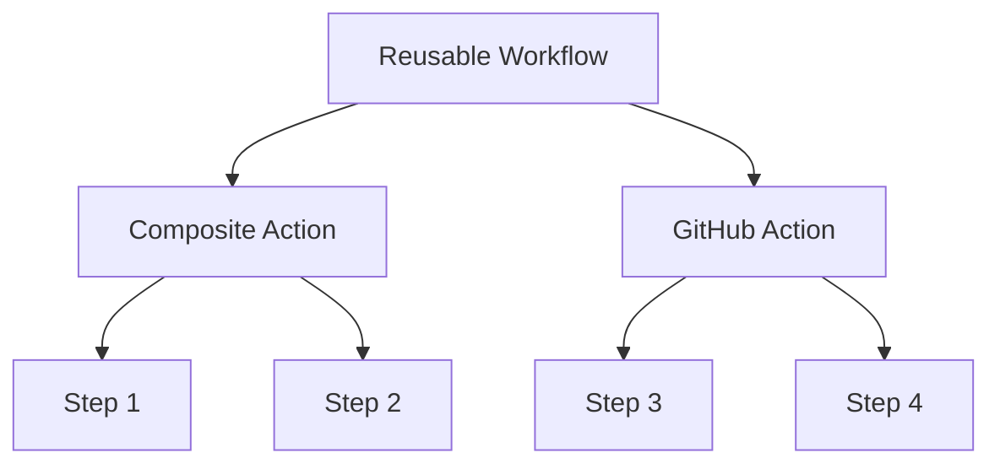

# DevantlerTech GitHub Actions - Reusable Workflows 🚀

Welcome to the DevantlerTech GitHub Actions repository! This repository contains [reusable workflows](#reusable-workflows) designed to streamline your CI/CD processes.  These actions are used across all DevantlerTech projects, ensuring consistency and efficiency.

The below diagram illustrates the relationship between reusable workflows, composite actions, and other GitHub Actions.



## Reusable Workflows

[Reusable workflows](https://docs.github.com/en/actions/how-tos/sharing-automations/reuse-workflows#creating-a-reusable-workflow) are designed to encapsulate common CI/CD patterns that can be shared across multiple repositories. They allow you to define a workflow once and reuse it in the job-scope of other workflows. This reduces duplication and enables building generic workflows for common tasks.

### CD - Cluster Bootstrap

<details>
<summary>Click to expand</summary>

[.github/workflows/reusable-workflow-cd-cluster-bootstrap.yaml](.github/workflows/reusable-workflow-cd-cluster-bootstrap.yaml) is a workflow used to bootstrap a cluster on the DevantlerTech platform. It installs core components like Cilium and Flux.

#### Usage

To use this reusable workflow, you can include it in your workflow file as follows:

```yaml
jobs:
  bootstrap-cluster:
    uses: devantler-tech/github-actions/.github/workflows/reusable-workflow-cd-cluster-bootstrap.yaml@{ref} # ref
    secrets:
      KUBE_CONFIG: ${{ secrets.KUBE_CONFIG }}
      SOPS_AGE_KEY: ${{ secrets.SOPS_AGE_KEY }}
    with:
      DEPLOYMENT_ENV: dev
```

#### Secrets and Inputs

| Key              | Type           | Default | Required | Description            |
| ---------------- | -------------- | ------- | -------- | ---------------------- |
| `KUBE_CONFIG`    | Secret         | -       | ✅        | Kubernetes config file |
| `SOPS_AGE_KEY`   | Secret         | -       | ✅        | Age key for SOPS       |
| `DEPLOYMENT_ENV` | Input (string) | `dev`   | ✅        | Deployment environment |

</details>

### CD - .NET Application Publish

<details>
<summary>Click to expand</summary>

[.github/workflows/reusable-workflow-cd-dotnet-application-publish.yaml](.github/workflows/reusable-workflow-cd-dotnet-application-publish.yaml) is a workflow used to publish .NET applications.

#### Usage

```yaml
jobs:
  publish-application:
    uses: devantler-tech/github-actions/.github/workflows/reusable-workflow-cd-dotnet-application-publish.yaml@{ref} # ref
    secrets:
      NUGET_API_KEY: ${{ secrets.NUGET_API_KEY }}
```

#### Secrets and Inputs

| Key             | Type   | Default | Required | Description   |
| --------------- | ------ | ------- | -------- | ------------- |
| `NUGET_API_KEY` | Secret | -       | ✅        | NuGet API key |

</details>

### CD - .NET Library Publish

<details>
<summary>Click to expand</summary>

[.github/workflows/reusable-workflow-cd-dotnet-library-publish.yaml](.github/workflows/reusable-workflow-cd-dotnet-library-publish.yaml) is a workflow used to publish .NET libraries to NuGet and GHCR.

#### Usage

```yaml
jobs:
  publish-library:
    uses: devantler-tech/github-actions/.github/workflows/reusable-workflow-cd-dotnet-library-publish.yaml@{ref} # ref
    secrets:
      NUGET_API_KEY: ${{ secrets.NUGET_API_KEY }}
```

#### Secrets and Inputs

| Key             | Type   | Default | Required | Description   |
| --------------- | ------ | ------- | -------- | ------------- |
| `NUGET_API_KEY` | Secret | -       | ✅        | NuGet API key |

</details>

### CD - GitOps Deploy

<details>
<summary>Click to expand</summary>

[.github/workflows/reusable-workflow-cd-gitops-deploy.yaml](.github/workflows/reusable-workflow-cd-gitops-deploy.yaml) is a workflow used to deploy applications using GitOps with Flux.

#### Usage

```yaml
jobs:
  gitops-deploy:
    uses: devantler-tech/github-actions/.github/workflows/reusable-workflow-cd-gitops-deploy.yaml@{ref} # ref
    secrets:
      KUBE_CONFIG: ${{ secrets.KUBE_CONFIG }}
      SOPS_AGE_KEY: ${{ secrets.SOPS_AGE_KEY }}
    with:
      DEPLOYMENT_ENV: dev
```

#### Secrets and Inputs

| Key              | Type           | Default | Required | Description            |
| ---------------- | -------------- | ------- | -------- | ---------------------- |
| `KUBE_CONFIG`    | Secret         | -       | ✅        | Kubernetes config file |
| `SOPS_AGE_KEY`   | Secret         | -       | ✅        | Age key for SOPS       |
| `DEPLOYMENT_ENV` | Input (string) | `dev`   | ✅        | Deployment environment |

</details>

### CI - Auto Merge

<details>
<summary>Click to expand</summary>

[.github/workflows/reusable-workflow-ci-auto-merge.yaml](.github/workflows/reusable-workflow-ci-auto-merge.yaml) is a workflow that automatically merges pull requests from trusted bots and maintainers.

#### Usage

```yaml
jobs:
  auto-merge:
    uses: devantler-tech/github-actions/.github/workflows/reusable-workflow-ci-auto-merge.yaml@{ref} # ref
```

</details>

### CI - .NET Test

<details>
<summary>Click to expand</summary>

[.github/workflows/reusable-workflow-ci-dotnet-test.yaml](.github/workflows/reusable-workflow-ci-dotnet-test.yaml) is a workflow used to test .NET solutions or projects across multiple operating systems.

#### Usage

```yaml
jobs:
  dotnet-test:
    uses: devantler-tech/github-actions/.github/workflows/reusable-workflow-ci-dotnet-test.yaml@{ref} # ref
    secrets:
      CODECOV_TOKEN: ${{ secrets.CODECOV_TOKEN }}
```

#### Secrets and Inputs

| Key             | Type   | Default | Required | Description   |
| --------------- | ------ | ------- | -------- | ------------- |
| `CODECOV_TOKEN` | Secret | -       | ✅        | Codecov token |

</details>

### CI - GitOps Test

<details>
<summary>Click to expand</summary>

[.github/workflows/reusable-workflow-ci-gitops-test.yaml](.github/workflows/reusable-workflow-ci-gitops-test.yaml) is a workflow used to test GitOps configurations with Flux.

#### Usage

```yaml
jobs:
  gitops-test:
    uses: devantler-tech/github-actions/.github/workflows/reusable-workflow-ci-gitops-test.yaml@{ref} # ref
    secrets:
      KSAIL_SOPS_KEY: ${{ secrets.KSAIL_SOPS_KEY }}
    with:
      HOSTS_FILE: hosts
      ROOT_CA_CERT_FILE: root-ca.crt
```

#### Secrets and Inputs

| Key                 | Type           | Default | Required | Description                      |
| ------------------- | -------------- | ------- | -------- | -------------------------------- |
| `KSAIL_SOPS_KEY`    | Secret         | -       | ❌        | SOPS Age key for KSail           |
| `HOSTS_FILE`        | Input (string) | -       | ❌        | Path to hosts file for testing   |
| `ROOT_CA_CERT_FILE` | Input (string) | -       | ❌        | Path to root CA certificate file |

</details>

### CI - GitOps Validate

<details>
<summary>Click to expand</summary>

[.github/workflows/reusable-workflow-ci-gitops-validate.yaml](.github/workflows/reusable-workflow-ci-gitops-validate.yaml) is a workflow used to validate GitOps cluster configurations.

#### Usage

```yaml
jobs:
  gitops-validate:
    uses: devantler-tech/github-actions/.github/workflows/reusable-workflow-ci-gitops-validate.yaml@{ref} # ref
```

</details>

### Release

<details>
<summary>Click to expand</summary>

[.github/workflows/reusable-workflow-release.yaml](.github/workflows/reusable-workflow-release.yaml) is a workflow used to create releases using semantic-release.

#### Usage

```yaml
jobs:
  release:
    uses: devantler-tech/github-actions/.github/workflows/reusable-workflow-release.yaml@{ref} # ref
    secrets:
      APP_PRIVATE_KEY: ${{ secrets.APP_PRIVATE_KEY }}
```

#### Secrets and Inputs

| Key               | Type   | Default | Required | Description            |
| ----------------- | ------ | ------- | -------- | ---------------------- |
| `APP_PRIVATE_KEY` | Secret | -       | ✅        | GitHub App private key |

</details>

### Sync Cluster Policies

<details>
<summary>Click to expand</summary>

[.github/workflows/reusable-workflow-sync-cluster-policies.yaml](.github/workflows/reusable-workflow-sync-cluster-policies.yaml) is a workflow used to sync upstream Kyverno policies to a target directory.

#### Usage

```yaml
jobs:
  sync-cluster-policies:
    uses: devantler-tech/github-actions/.github/workflows/reusable-workflow-sync-cluster-policies.yaml@{ref} # ref
    secrets:
      APP_PRIVATE_KEY: ${{ secrets.APP_PRIVATE_KEY }}
    with:
      KYVERNO_POLICIES_DIR: policies/kyverno
```

#### Secrets and Inputs

| Key                    | Type           | Default | Required | Description                           |
| ---------------------- | -------------- | ------- | -------- | ------------------------------------- |
| `APP_PRIVATE_KEY`      | Secret         | -       | ✅        | GitHub App private key                |
| `KYVERNO_POLICIES_DIR` | Input (string) | -       | ✅        | Directory to sync Kyverno policies to |

</details>

### TODOs

<details>
<summary>Click to expand</summary>

[.github/workflows/reusable-workflow-todos.yaml](.github/workflows/reusable-workflow-todos.yaml) is a workflow used to scan for TODOs in code and create GitHub issues.

#### Usage

```yaml
jobs:
  todos:
    uses: devantler-tech/github-actions/.github/workflows/reusable-workflow-todos.yaml@{ref} # ref
    secrets:
      APP_PRIVATE_KEY: ${{ secrets.APP_PRIVATE_KEY }}
```

#### Secrets and Inputs

| Key               | Type   | Default | Required | Description            |
| ----------------- | ------ | ------- | -------- | ---------------------- |
| `APP_PRIVATE_KEY` | Secret | -       | ✅        | GitHub App private key |

</details>

### Zizmor

<details>
<summary>Click to expand</summary>

[.github/workflows/reusable-workflow-zizmor.yaml](.github/workflows/reusable-workflow-zizmor.yaml) is a workflow used to perform static analysis on GitHub Actions workflows.

#### Usage

```yaml
jobs:
  zizmor:
    uses: devantler-tech/github-actions/.github/workflows/reusable-workflow-zizmor.yaml@{ref} # ref
```

</details>
